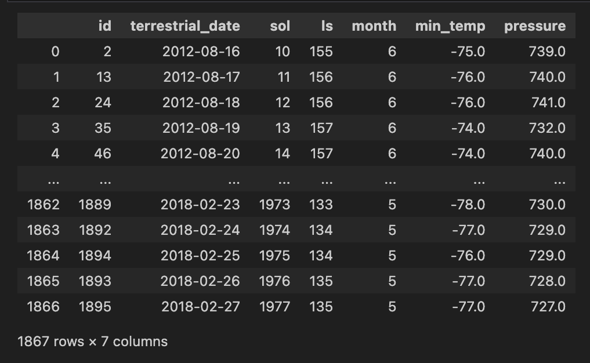
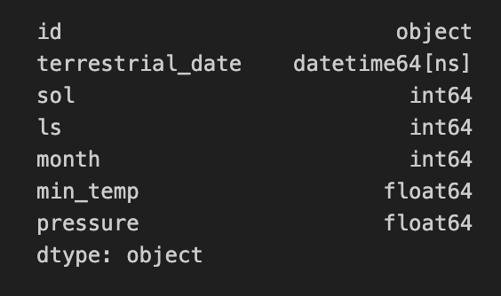
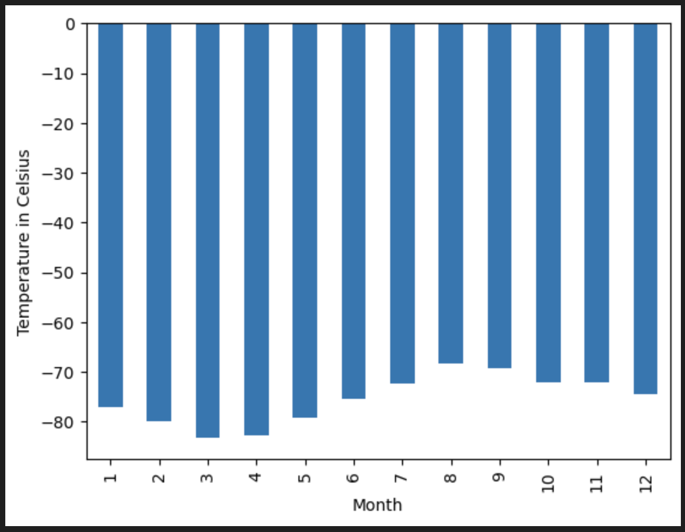
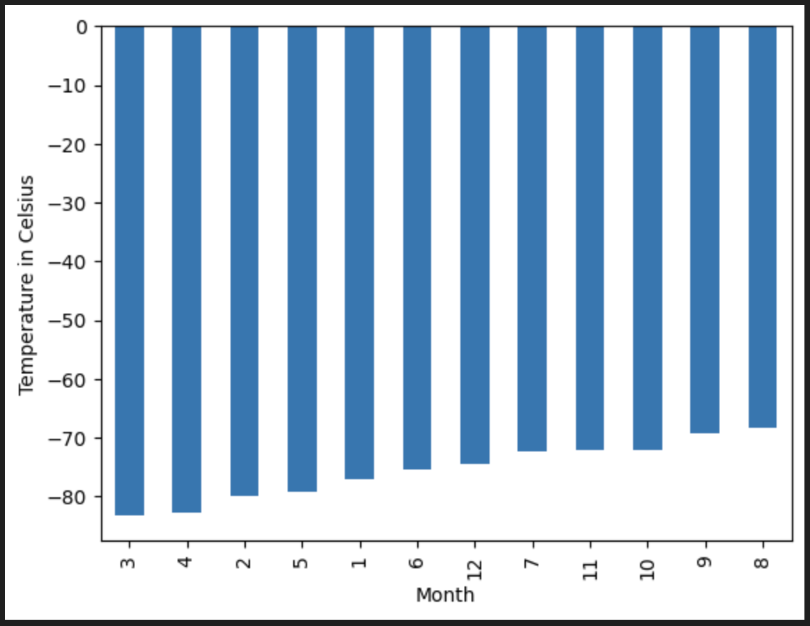
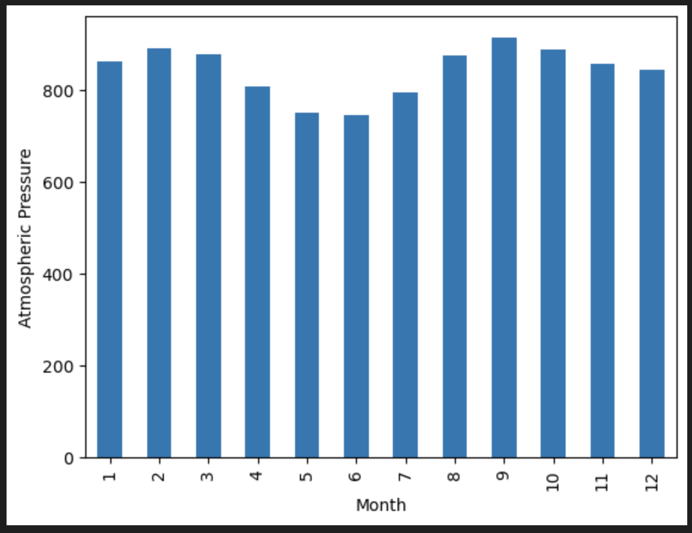
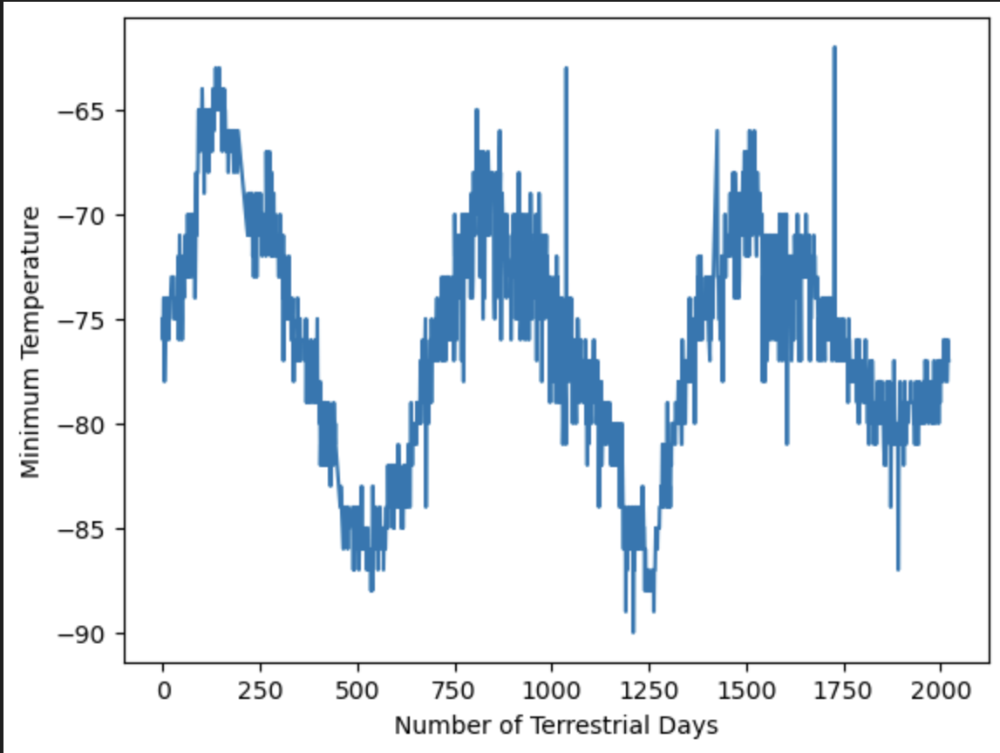

# Web-Scraping-Challenge :rocket: :comet:
*In this assignment, I’ll use my Web-Scraping skills to utilise and extract data from provided url link and convert information using Pandas for further visualization and analysis.*

# Background
You’re now ready to take on a full web-scraping and data analysis project. You’ve learned to identify HTML elements on a page, identify their id and class attributes, and use this knowledge to extract information via both automated browsing with Splinter and HTML parsing with Beautiful Soup. You’ve also learned to scrape various types of information. These include HTML tables and recurring elements, like multiple news articles on a webpage.

As you work on this Challenge, remember that you’re strengthening the same core skills that you’ve been developing until now: collecting data, organising and storing data, analysing data, and then visually communicating your insights.

This new assignment consists of two technical products. You will submit the following deliverables:

Deliverable 1: Scrape titles and preview text from Mars news articles.

Deliverable 2: Scrape and analyse Mars weather data, which exists in a table.

## Part 1:  Scrape Titles and Preview Text from Mars News
I started with importing all the required dependencies.
* Then, I automated browsing to visit `Mars news site`.
* I created a BeautifulSpoon object and used it to extract elements from the website.
* Extracted all the titles and previews of the news articles. I stored them in a required format of a Python list.
* Printed the list in my Jupyter Notebook.
* Exported scraped data to a JSON file.

## Part 2: Scrape and Analyse Mars Weather Data
I started with importing all the required dependencies.
* Then, I automated browsing to visit `Mars weather data site`.
* I created BeautifulSoup object to scrape the data in the HTML table using BeautifulSoup.
* I assembled scraped data into Pandas DataFrame providing the table with required columns as per instructions. 

* I examined the data types that are currently in my set and associated with each column, then I converted them to appropirate data types (`datetime`, `float`, `int`).

* I analysed dataset and answered the following questions: 

1. How many months exist on Mars?

2. How many Martian (and not Earth) days worth of data exist in the scraped dataset?

3. What are the coldest and the warmest months on Mars (at the location of Curiosity)? To answer this question:

    Find the average minimum daily temperature for all of the months.
    Plot the results as a bar chart.
    

    Identified the coldest and hottest months in Curiosity's location:
    

4. Which months have the lowest and the highest atmospheric pressure on Mars? To answer this question:
    * Find the average daily atmospheric pressure of all the months.
    * Plot the results as a bar chart.

    

5. About how many terrestrial (Earth) days exist in a Martian year? To answer this question:
   * Consider how many days elapse on Earth in the time that Mars circles the Sun once.
    * Visually estimate the result by plotting the daily minimum temperature.

    

* Exported the DataFrame to a CSV file.

#### Technologies used
* *Visual Studio Code*
* *Excel* 
* *GitHub* 
* **BeautifulSoup**
* *JupyterNotebook*
* *JSON*

#### File list
* Directory "Codes" containing: part_1_mars_news.ipynb, part_2_weather.ipynb and mars_weather_data.csv, mars.json.
* Various Screen Shots in ss direcory.
* README.md

Cover Photo Sourced from: https://www.google.com/url?sa=i&url=https%3A%2F%2Fwww.linkedin.com%2Fcompany%2Fmars-foundation&psig=AOvVaw1-1tbGSczCOcEEtA9t28tD&ust=1708845577585000&source=images&cd=vfe&opi=89978449&ved=0CBMQjRxqFwoTCIiH7f63w4QDFQAAAAAdAAAAABAe